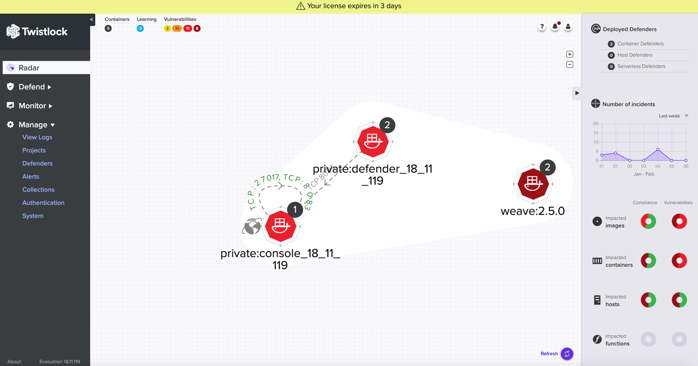
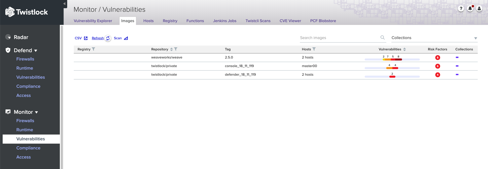

# Twistlock Overview

*So what’s this “Twistlock”. Twistlock is a rule-based access control
policy system for Docker and Kubernetes containers.*

*Twistlock handles image scanning. You can scan an entire container
image, including any packaged Docker application or Node.js component.
You can apply application scan and apply filters to monitor them.*

*Twistlock also deals with image scanning of containers within the
registries themselves. In runtime environments, Twistlock features a
Docker proxy running on the same server with an application’s other
containers.*

*We will try and cover many aspects on Twistlock like architecture,
deployment, user access, backup and operations.*

*Deployment will be on IBM cloud, for others there are a number of
documents available to read on Twistlock web portal.*

### Solution Overview 

This paper will provides an overview on Twistlock security product.
Twistlock is a commercial product which is used for container monitoring
and management across cloud platform.

Twistlock can be deployed as a set of containers on your hosts called as
**“Defenders”**.

Twistlock is easily integrated into your container build
process(Orchestration tools) with support available for continuous
integration (CI) systems and registry scanning capabilities.

### Twistlock Advanced Threat Protection

Twistlock provide a feature for threat protection called as **Twistlock
Advanced Threat Protection (TATP),** is a collection of malware
signatures and IP reputation lists aggregated from commercial threat
feeds, open source threat feeds, and Twistlock Labs, delivered via the
Twistlock Intelligence Stream.

The data in TATP is used by Twistlock’s runtime defence system to detect
suspicious activities, such as a container communicating with a botnet
herder or Tor entry node. You are free to augment TATP by importing
custom malware data and importing IP reputation lists. TATP is the
combination of both the Twistlock-provided data set and your own custom
data set.

### App-specific network intelligence

Twistlock will learn about the settings for your apps from their
configuration files, and use this knowledge to detect runtime anomalies.
No special configuration is required to enable this feature. In addition
to identifying ports that are exposed via the EXPOSE directive in a
*Dockerfile*, or the -p argument passed to docker run, Twistlock can
identify port settings from an app’s configuration file. This enables
Twistlock to detect, for example, if the app has been changed or altered
to listen on an unexpected port, or if a malicious process has managed
to listen on the app’s port to steal data.

The Twistlock Intelligence Stream delivers app-specific knowledge so
that Defender can inspect an image and:

-   Identify processes that the container will execute.

-   Correlate the processes with their configuration files.

-   Parse the configuration files to extract information such as port
    assignments.

## Twist Lock architecture:

Twistlock consists of a number of components like console, defender,
intelligent stream and CLI tool

### Twistlock Console 

The Twistlock Console serves as the user interface within Twistlock. The
graphical user interface (GUI) lets you define policy, configure and
control your Twistlock deployment, and view the overall health (from a
security perspective) of your container environment. Console also
provides an API for customers that want to control Twistlock
programmatically to build out their own integrations or custom tooling.
The API is thoroughly documented. Endpoints are provided for all
features, functions, and controls offered in the GUI.

Figure 1 Twistlock basic architecture

### Twistlock Defender 

The Defender(s) are the points of enforcement. Defender runs on each of
your hosts and carries out any policies that you set in Console.

Twistlock Defender enforces the policy defined in Console. There are two
primary types of deployments for Defenders.

-   The first Defender type is deployed as a container each host running
    containers you want to secure and provides the scanning in a
    scalable way over the entire environment. When deployed as a
    container, Defender does not run as a privileged container which is
    insecure, instead Defender runs as a root container and adhering to
    the principle of least privilege, Defender utilizes just four linux
    capabilities: *CAP\_NET\_ADMIN, CAP\_SYS\_ADMIN, CAP\_SYS\_PTRACE,
    and CAP\_AUDIT\_CONTROL*

-   The second is a Defender deployed for Virtual Machines that do not
    run containers.

You can install defender on each host that you want to protect. Use this
method when you’re not using an orchestrator, or for simple
proof-of-concept environments. You can also install Defenders via
whatever configuration management or automation tools you are already
using, Ansible, Puppet, or Chef for example.

As a orchestrator-native construct. For example, you can deploy Defender
as a Daemon Set in Kubernetes and OpenShift environments or as a global
service in Docker Swarm environments. Orchestrator-native constructs
ensure that Defender is automatically deployed to every node in the
cluster, even as the cluster dynamically scales up or down.

### The twistcli Tool 

> The twistcli tool is a command-line control and configuration tool. It
> ships with your Twistlock release and can be found in the Twistlock
> release tarball. Support is provided for both Linux and OS X.

The twistcli tool provides a number of functions:

-   Scan images for vulnerabilities and compliance issues. Pretty good
    when you’re building custom tooling, or when you’re using a CI tool
    for which Twistlock does not provide a native plugin.

-   Deploying (installing and uninstalling) Console and Defender.

-   Downloading the latest threat data from the Intelligence Stream for
    transfer to an air-gapped environment.

Figure 2 Basic scanning capabilities of Twistlock

The above highlights the ways Twistlock scans application images in K8
environment.

## Twistlock Deep dive

### Master Node Components

#### ICP Management Components:

Standard IBM ICP management components. Description is “Out of scope of
this document”.

#### ETCD

**etcd** is a distributed key-value store, **etcd** is the primary
datastore of **Kubernetes**; storing and replicating
all **Kubernetes** cluster state. As a critical component of
a **Kubernetes** cluster having a reliable automated approach to its
configuration and management is imperative.

Figure 3 Twistlock deployment Architecture

#### KMS components

Encryption key management is the administration for protecting, storing,
backing up and **organizing** encryption keys. High-profile data losses
and regulatory compliance requirements have caused a dramatic increase
in the use of encryption in the enterprise. Twistlock can be integrated
with number of components like AWS and others, I have not been able to
test or verify how IBM Key Protect can be integrated at the moment.

#### Twistlock Master Console

The Twistlock console administers all the users via AD/LDAP and there
are service accounts which will be applied for only security groups or
users as needed. Twistlock users and console users can define policies
which can then be applied across the clusters via defenders. Policies
definitions, scanning, and threat analysis.

#### API Server

Twistlock integrated with API servers as the RESTAPI which integrates at
the back end which will provide API based when scripts are invoked. When
using CI/CD pipeline, these API provides authentication and
authorisation for people to deploy containers. Certificates are also
registered in the API Servers

#### Scheduler

Twistlock runs on any implementation of Kubernetes such as ICP and IKS.
Once installed on K8 or ICP this will integrate with K8 scheduler for
defender deployment on new hosts.

#### Kubelet in K8

New container which are deployed by kubelet are scanned by Twistlock via
application scanner. If there are new container deployed by YAML via
scripts then they are scanned by the run time analysis. Further
description is in the next section [container
creation](#container-policy-enforcement-with-twistlock)

### Networking

Twistlock can monitor container networking activity for patterns that
indicate an attack might be underway. These features can be
independently enabled or disabled with runtime rules. The final policy
that’s enforced is the sum of the container model and your runtime
rules.

##### IP connectivity

When Twistlock detects an outgoing connection that deviates from your
runtime policy, Twistlock Defender can take action. Networking rules let
you put Defender into one of three modes:

**Disable** — Defender does not provide any networking protection.

**Alert** — Defender raises alerts when targeted resources establish
connections that violate your runtime policy. The corresponding audits
can be reviewed under **Monitor &gt; Runtime &gt; Container Audits**.

**Block** — Defender stops the container if it establishes a connection
that violates your runtime policy. The corresponding audit can be
reviewed under **Monitor &gt; Runtime &gt; Container Audits**

##### Detect port scanning

Port scans are used by attackers to find which ports on a network are
open and listening. If enabled, Defenders detect network behaviour
indicative of port scanning. If detected, a [port scanning
incident](https://docs.twistlock.com/docs/latest/runtime_defense/incident_types/port_scanning.html) is
created in Incident Explorer.

##### DNS

Modern attacks, particularly coordinated, long running attacks, use
short lived DNS names to route traffic from the victim’s environment to
command and control systems. This is common in large scale botnets. When
DNS monitoring is enabled (Alert, Prevent, or Block) in your runtime
rules, Twistlock analyzes DNS lookups from your running containers. By
default, DNS monitoring is disabled.

Dangerous domains are detected as follows:

**Twistlock Intelligence Stream** — Twistlock’s threat feed contains a
list of known bad domains.

**Behavioral container models** — When learning a model for a container,
Twistlock records any DNS resolutions that a container makes. When the
model is activated, Defender monitors network traffic for DNS
resolutions that deviate from the learned DNS resolutions. Audits from
DNS monitoring may be be used to trigger a data exfiltration incident.

You can see the domains in the model by going to **Monitor &gt; Runtime
&gt; Container Models**, clicking on a model, then opening
the **Networking** tab. Known good domains are listed
under **Behaviorally learned domains**.

**Explicit whitelists and blacklists:** Runtime rules let you augment
the Twistlock’s Intelligence Stream data and models with your own
explicit whitelists and blacklists of known good and bad domains. Define
these lists in your runtime rules.

### Scheduling Components

##### Replica controller

A *Replication Controller* will ensure that a specified number of pod
replicas are running at any one time, which is provided as a part of
Helm charts or YAML file description those number of container are
deployed in the cluster and namespace in Kubernetes environment, a
Replication Controller makes sure that a pod or a homogeneous set of
pods is always up and available.

##### Autoscaler

Cluster Autoscaler - a component that automatically adjusts the size of
a Kubernetes Cluster so that all pods have a place to run and there are
no unneeded nodes.

##### Policies management in K8

A *Pod Security Policy* is a cluster-level resource which controls
security sensitive aspects of the pod specification.
The PodSecurityPolicy objects define a set of conditions that a pod must
run with in order to be accepted into the system, as well as defaults
for the related fields.

Pod security policy control is implemented and enforced by enabling the
admission controller.

Since the pod security policy API (policy/v1beta1/podsecuritypolicy) is
enabled independently of the admission controller, for existing clusters
it is recommended that policies are added and authorized before enabling
the admission controller. **Twistlock integrates with the admission
policies of Kuberentes when this integrates with K8 stack.**

##### Helm Charts

Helm charts are best suited for apps deployment in ICP environment.
Twistlock Defender can be deployed via helm chart as a part of new host
addition to cluster.

##### Twistlock Supervisor

It is a slave Console responsible for the operation of a project.
Supervisor Consoles don’t work on their own but perform functionalities
from the primary console, they are headless. Their UI and API are not
directly accessible. Instead, users interact with a project from Central
Console’s UI and API.

### Users access

There are number of users who access Twistlock via AD/LDAP. This table
explains the roles and use cases.

<table>
<thead>
<tr class="header">
<th>Role</th>
<th>Access level</th>
<th>Typical uses case(s)</th>
</tr>
</thead>
<tbody>
<tr class="odd">
<td>Administrator</td>
<td>Full read-write access to all Twistlock settings and data.</td>
<td>Security administrators.</td>
</tr>
<tr class="even">
<td>Operator</td>
<td>
Read-write access to all rules and data.

Read-only access to user and group management, and role assignments.
</td>
<td>Security operations teams.</td>
</tr>
<tr class="odd">
<td>Defender Manager</td>
<td>
Read-only access to all rules and data.

Can install and uninstall Defenders.
</td>
<td>DevOps and sysadmins for the nodes that Twistlock protects.</td>
</tr>
<tr class="even">
<td>Auditor</td>
<td>Read-only access to all Twistlock rules and data.</td>
<td>Auditors and compliance staff that need to verify settings and monitor compliance.</td>
</tr>
<tr class="odd">
<td>DevOps User</td>
<td>Read-only access to the Twistlock vulnerability scan reports only.</td>
<td>Developer, Operations, and DevOps personnel that need to know about and/or address the vulnerabilities in the resources in your environment.</td>
</tr>
<tr class="even">
<td>Access User</td>
<td>Install personal certificates only.</td>
<td>Developers (and others) that use the nodes that Twistlock protects.</td>
</tr>
<tr class="odd">
<td>CI User</td>
<td>Run the Continuous Integration plugin only.</td>
<td>CI Users can only run the plugin and have no other access to configure Twistlock.</td>
</tr>
</tbody>
</table>

Further description on users and AD integration is in the section
[access controls](#access-control)

### Container Policy enforcement with Twistlock

Defender is responsible for enforcing vulnerability and compliance
blocking rules. When a blocking rule is created, Defender moves the
original runC binary to a new path and inserts a Twistlock runC shim
binary in its place.

When a command to create a container is issued, it propagates down the
layers of the container orchestration stack, eventually terminating at
runC. Regardless of your environment (Docker, Kubernetes, or OpenShift,
etc) and underlying CRI provider, runC does the actual work of
instantiating a container.

Figure 4 Container deployment and policy enforcement via Twistlock

When starting a container in a Twistlock-protected environment:

-   The Twistlock runC shim binary intercepts calls to the runC binary.

-   The shim binary calls the Defender container to determine whether
    the new container should be created based on the installed policy.

    -   If Defender replies affirmatively, the shim calls the original
        runC binary to create the container, and then exits.

    -   If Defender replies negatively, the shim terminates the request.

    -   If Defender does not reply within 60 seconds, the shim calls the
        original runC binary to create the container and then exits.

## Design consideration

Twistlock supports two model multitenancy( multi-site or single site
multi tenancy) and unlimited scale ( single large scale)deployment. Both
the design can be achieved by Projects capabilities. Twistlock support
two types of Projects:

Projects allows us to create and deploy a single master Console, with a
single URL, that can scale out to support an infinite number of
container hosts. You can set up an environment that shares the same
rules and configurations as the master Console, or deploy separate
compartmentalized environments which operate independently with their
own rules and configurations.

For example, you might have <https://console.ibm.com> ( this can be
public or private url exposed to only those users)as the single URL for
accessing the Console UI and API. Then you must deploy a Console to each
of your regional data centers to support a scaled-out production
environment, or segregated instances of Console for each business unit,
or both, and manage all of them from a single Central Console.

Role-based access control (RBAC) rules manage who can access which
project. When users log onto Twistlock Central Console, they are shown a
list of projects to which they have access and can switch between them.

**Central Console**

> Also known as the master Console or just master. This is the interface
> from which administrators manage (create, access, and delete) their
> projects.

**Supervisor**

> Secondary, slave Console responsible for the operation of a project.
> Supervisor Consoles are headless. Their UI and API are not directly
> accessible. Instead, users interact with a project from Central
> Console’s UI and API.

**Project**

> A deployment unit that consists of a Supervisor Console and up to
> 1,000 Defenders. There are two types of projects: scale projects and
> tenant projects.

**Scale project**

> The Supervisor Console inherits all rules and settings from the
> Central Console. Stack multiple scale projects together to deploy
> Twistlock to large environments with a large number of hosts. Each
> scale project supports 1,000 Defenders. Two scale projects can support
> and environment with 2,000 hosts, three scale projects supports 3,000
> hosts, and so on.

**Tenant project**

> Tenant projects maintain all their own rules and settings, separate
> from Central Console and any other Supervisor Consoles.

### Decision Tree on deployment

Understand what you need to implement and then determine whether you
need projects( multi tenancy or unlimited scale). Provisioning projects
when they are not required will needlessly complicate the operation and
administration of your environment.

-   **Does your container environment have more than 1,000 hosts?**

> If yes, then provision a scale project, where each scale project can
> handle a maximum of 1,000 hosts (Defenders). Add a scale project for
> every 1,000 hosts in your environments. Stacked scale projects work
> together as a single, cohesive environment with shared rules and
> settings. If your environment has fewer than 1,000 hosts, then you do
> not need to provision any scale projects. A single Console will be
> sufficient for your needs. You can always migrate to a project
> structure if your environment does grow past 1,000 hosts.

-   **Do you have multiple segregated environments, where each
    environment must be configured with its own rules and policies?**

***If yes, then deploy a tenant project for each environment. In this
environment each tenant supervisor can handle and manage maximum 1000
defenders with isolation of other tenant projects.***

### Multitenancy — Tenant Projects 

The Central Console has full visibility into the entire estate. You can
then setup tenant projects which act as a self-contained Console and
Defender setup. Users can only see and administer their subsection of
the estate.

Tenant projects are like silos. They each have their own rules and
settings that are created and maintained separately from all other
projects.

### Scale — Scale Projects 

Each Console can support 1,000 Defenders. By utilising Scale Projects,
we can allocate Consoles to a Central Console. This enables an unlimited
number of Defenders.

Defenders communicate to the scale project Console (1,000 Defenders per
scale project Console) and the scale project Console aggregates and
sends to a Central Console.

Policies and rules are inherited by the scale project from the Central
Console. Users and administrators operate the Central Console which then
pushes changes to the scale projects.

## Twistlock on IBM Cloud

Twistlock supports deploying Console and Defenders into Kubernetes
clusters.

The Twistlock Console is installed as a replication controller with
persistent storage, which allows the Console to be resilient to node
failures.

Defenders are deployed to Kubernetes nodes using DaemonSets. DaemonSets
make Defender deployment simple and automatic, regardless of how large
your cluster or how frequently you add nodes to it. With DaemonSets,
rather than manually installing Twistlock Defenders on each node,
Twistlock generates a configuration file that you load into your
Kubernetes Master. Kubernetes uses the configuration to ensure that
every node in the cluster runs a Defender. As new nodes are added,
Defenders are automatically installed on them. Deploying Defenders with
Daemon Sets guarantees that every node in your environment is protected,
without having to manually intervene when node membership changes.

### Cloud deployment on Single site

#### Single cluster

Figure 5 Deployment in a single Data Centre in multiple Cluster

### Cloud deployment on multiple Site

#### Multiple site and multiple cluster or projects

Figure 6 Multi Site deployment in IBM Cloud for ICP on VMware

## Disaster recovery

### Overview

Twistlock disaster recovery automatically backs up all data and
configuration files periodically. You can view all backups, make new
backups, and restore specific backups from the Console UI. You can also
restore specific backups using the twistcli command line utility.

Twistlock is implemented with containers that cleanly separate the
application from its state and configuration data. To back up a
Twistlock installation, only the files in the data directory need to be
archived. Because Twistlock containers read their state from the files
in the data directory, Twistlock containers do not need to be backed up,
and they can be installed and restarted from scratch.

When data recovery is enabled (default), Twistlock archives its data
files periodically and copies the backup file to a location you specify.
The default path to the data directory is */var/lib/twistlock*. You can
specify a different path to the data directory in *twistlock.cfg* when
you install Console.

### Automated backups

By default, automated backups are enabled. With automated backups
enabled, Twistlock takes a daily, weekly, and monthly snapshots. These
are known as system backups.

To specify a different backup directory or to disable automated backups,
modify *twistlock.cfg* and install (or reinstall) Twistlock Console. The
following configuration options are available:

<table>
<thead>
<tr class="header">
<th>Configuration option</th>
<th><strong>Description</strong></th>
</tr>
</thead>
<tbody>
<tr class="odd">
<td>DATA_RECOVERY_ENABLED</td>
<td>
Enables or disables automated backups.

<ul>
<li>
Enables automated backups (default).
</li>
<li>
Disables automated backups: <strong>disable</strong>
</li>
</ul></td>
</tr>
<tr class="even">
<td>DATA_RECOVERY_VOLUME</td>
<td>
Specifies the directory where backups are saved.

For example, archives could be saved on durable persistent storage, such as a volume from Amazon Elastic Block Storage (EBS).

The default value is <em>/var/lib/twistlock-backup</em>.
</td>
</tr>
</tbody>
</table>

##  System Requirements

#### BareMetal: 

Twistlock has the following hardware requirements:

Console —

-   When fewer than 100 Defenders are connected, Console requires 1GB of
    RAM and 10GB of storage.

-   When more than 100 Defenders are connected, Console requires 3GB of
    RAM and 50GB of storage.

Defender —

-   256MB of RAM and 8GB of storage. NOTE: Defender uses cgroups to cap
    resource usage at 512MB of RAM and 900 CPU shares; typical load is
    \~1-2% CPU and 20-40MB RAM

Registry scanning —

-   2GB of RAM, 20GB of storage, and 2 CPU cores.

CI integration (Jenkins, twistcli) —

-   Required storage space depends on the size of the scanned images.
    The required disk space is 1.5 times the size of the largest image
    to be scanned, per executor. For example, if you have a Jenkins
    instance with two executors, and your largest container image is
    500MB, then you need at least 1.5GB of storage space (500MB \*
    1.5 \* 2).

#### Virtual Machine: 

Twistlock has been tested on the following hypervisors:  
• Microsoft Hyper-V

• VirtualBox

• VMware

### Host operating systems

Twistlock is supported on the following host operating systems:

Twistlock can protect containers built on nearly any base layer
operating system. Comprehensive Common Vulnerabilities and Exposures
(CVE) data is provided for the following base layers:

• Alpine

• Amazon Linux container image

• Amazon Linux 2

• BusyBox

• CentOS

• Debian

• EulerOS

• Red Hat Enterprise Linux

• SUSE

• Ubuntu

## Backup and restore

By default, Twistlock compresses and backs up your data once per day.
Backups are stored in the volume specified in twistlock.cfg. The default
backup location is /var/ lib/twistlock-backup.

## Firewall capabilities in Twistlock

Cloud Native Application Firewall (CNAF)

Cloud Native Network Firewall (CNNF)

### Cloud Native Application Firewall (CNAF)

CNAF is web application firewall (WAF) designed for containers. WAFs
secure web apps by inspecting and filtering layer 7 traffic to and from
the app. CNAF enhances the traditional WAF for container environments by
binding to containerized web apps, regardless of the cloud,
orchestrator, node, IP address where it runs, and without the need to
configure complicated routing.

To enable CNAF, create a new CNAF rule, select the protections to
enable, and specify your web app’s front end image. For each container
instance, Twistlock creates a firewall instance. Whenever a new policy
is created or an existing policy is updated, Twistlock immediately
pushes these rules to all the resources to which they apply.

CNAF runs as proxy between client requests and the container/service. It
inspects HTTP/HTTPS traffic before passing it to/from the container it
protects. CNAF responds to malicious traffic according to the rules you
have created. Alerts let the traffic flow to the container, but trigger
the alert machinery to send emails, Slack messages, or whatever else you
have configured. Blocking drops the malicious packets entirely.

### Cloud Native Network Firewall (CNNF)

This is a Layer 3 container-aware virtual firewall that utilizes machine
learning to identify valid traffic flows between app components, and
alert or block anomalous flows. Network segmentation and
compartmentalization is an important part of a comprehensive defence in
depth strategy. CNNF works as an east-west firewall between containers.
It limits damage by preventing attackers from moving laterally through
your environment when they have already compromised one part of it.

Container environments present new security challenges that cannot be
suitably addressed by traditional tools. In a container environment,
network traffic between nodes in a container environment is usually
encapsulated and encrypted in an overlay network. The IP addresses of
the endpoints are ephemeral and largely irrelevant, so rules such
as from 192.168.1.100 to 192.168.1.200, allow tcp/27017 do not apply
because you usually do not know, or even care, what IP address a
container is using at any given point in time. Finally, the total number
of endpoints can scale to thousands of containers. Tools that rely on
fragile, manually maintained rules cannot scale to secure a container
environment.

CNNF solves these problems by using machine learning to model network
traffic between containers. It automatically creates rules that
distinguish between good traffic from bad traffic.

When Twistlock first detects a container based on an image that it has
not seen before, it puts the container into learning mode. During
learning mode, Twistlock determines which network flows are allowed. It
looks at connections between containers and connections between
containers and external endpoints (which are routed over the host
network)

## Operational model

### Vulnerability Management

Twistlock uses an aggregated threat intelligence stream along with
learned data of deployed containers to manage vulnerability at every
stage in the container lifecycle from development to production.

### CI/CD Pipelines

Twistlock integrates with CI/ CD pipeline using native plugins or a
standalone vulnerability scanner and ensured that vulnerabilities are
addressed in the build stage of images.

### Runtime Defence

Runtime defence features network and application firewalls that secure
containers, Fargate, host, and serverless functions.

### Compliance

Twistlock’s Compliance Explorer enforces configurations and policy
controls on a container level. CIS, HIPAA, FISMA, PCI, and GDPR
compliance standards are available out-of-box

# Twistlock Console operations

Radar is the primary interface for monitoring and understanding your
environment. It is designed to let you visualize and navigate through
all of the data.

Radar makes it easy to conceptualize the architecture and connectivity
of large environments, identify risks, and zoom in on incidents that
require response. Radar provides a visual depiction of inter- and
intra-network connections between containers, applications, and cluster
services across your environment. It shows the ports associated with
each connection, the direction of traffic flow, and internet
accessibility. When Cloud Native Network Firewall is enabled, Twistlock
automatically generates the mesh shown in Radar based on what it has
learned about your environment.

Each image with running containers is depicted as a node in the graph.
Clicking on individual entities pops up an overlay that shows
vulnerability, compliance, and runtime issues.

Figure 7 Management Console View

The first view when you log into the Twistlock via AD.

This is the main dashboard for management, monitoring and analysis
purposes.

## Twistlock Dash Board

Figure 8 Dashboard View

### Manage

#### Deploy Projects via console

Figure 9 Deploy Supervisor via Projects in Console

Recommended to design projects for multi-tenancy setups or very large
environments (more than 1000 hosts).A single Central Console can
simultaneously support both Scale and Tenant Projects.

-   Tenant Projects enable multi-tenancy. They use centrally defined
    role-based access control, but have their own rules and
    configurations.

-   Scale Projects let you horizontally scale your environment to
    support a very large number of hosts. All rules and configurations
    are centrally defined.

#### Provision Tenancy or projects via console

Figure 10 configuring Project or tenancy

The console allows you to perform deployment of Projects for large scale
deployment via supervisor or deploy as tenancy for multi dc or cloud
environment

*You can choose Tenant or project, with project name and admin
credentials.*

### Defender management

Figure 11 Deploy Defend in your environment

Here this show you the list of all worker nodes listed in the console.

#### DNS name setting for defender deployment.

Figure 12 Defender DNS name setting

When you deploy defender you can easily classify and list based on DNS
names, identify and configure console to communicate it back to console.

#### Deploy Defender via Console

Figure 13 deploy defender through console across environment for each
node

Console allow admins to automatically deploy defender on new worker
nodes as a part of new installation via docker registry provided you
have valid license.

#### Deploy Daemon Set in K8 environment

Figure 14 deploy defender as daemon set across cluster nodes

Here you can deploy defender as daemon set and also configure number of
parameters such as monitoring status, registry from where you can
download and other parameters.

#### Swarm Deployment

Figure 15 Swarm deployment via console

Through console admins can consider deploying under swarm environment.

### Alerts

Figure 16 Alert configuration from TL

Console has the capability to integrate with Ticketing system or alert
tools

You can integrate and send alerts via email, you may need SMTP server
configured and route the emails to recipients. You can send it via slack
or traditional Netcool like products via webhooks. It supports Jira as
well.

### Collections

Figure 17 Setting Collection configuration

### Access Control

The Twistlock Console can be accessed via the graphical user interface
and the application programming interface.

The Twistlock Console supports the following authentication methods:

-   Username / Password

-   Lightweight Directory Access Protocol (LDAP)

-   Security Assertion Markup Language v2.0 (SAML2.0)

-   X.509 smart cards

Twistlock can apply password complexity rules for user accounts created
within Twistlock. For the authentication of external identities
Twistlock supports LDAP  
and SAML2.0. LDAP authentication supports the OpenLDAP and Active
Directory directories. Twistlock Console can be configured as an SAML2.0
Service Provider. The SAML2.0 Identity Providers that have been
successfully federated with the Twistlock Console are Okta, G Suite,
Ping, Shibboleth and Azure Active Directory. Smart card authentication
to the Twistlock Console requires configuring Twistlock with the

smart card’s chain of trust and matching the smart card’s
SubjectAlternativeName’s PrincipalName value to user’s corresponding
Twistlock username.

#### User Groups

Figure 18 Define user Group

You can add new users here in the console who would be Service account
users and their group would be tied to application, this can be
regulated and circulated with scripted via CyberArk tools for password
reset

Figure 19 new user addition

New users can be added and group can be selected. These are local users.
Apart from AD users.

#### Twistlock User Groups

Figure 20 new group creation

Admin can create a new group and then specify which user groups are
added to it

For example create a new group like IBM-IMCS-India. And add all users
groups i.e Admins, Guests, and others.

#### Secrets:

Figure 21 Secrets setting

KMS setting are done in this section

You can select standard KMS servers available and which are supported.

Figure 22 KMS server configuration and integration

You can select any of the available in the console and select any region
where you have installed.

Integration with IBM Key protect is not tested in the document.

You can integrate with AWS, Azure, CyberArk and HashiCorp vault

#### Logon Management

Figure Logon Integration

This allows a number of feature like disabling to API access via CLI or
console.

Requires strong password to adhere to AD, or local passwords.

You can set the token validity and time out for inactive

#### LDAP Integration

Figure 25 LDAP integration

Console can be integrated with LDAP access credentials.

#### SAML Integration

Security Assertion Mark-up Language (SAML) is an open standard that
allows identity providers (IdP) to pass authorization credentials to
service providers (SP). It is much simpler to manage one login per user
than it is to manage separate logins to email, customer relationship
management (CRM) software, Active Directory, etc.

SAML transactions use Extensible Mark-up Language (XML) for standardized
communications between the identity provider and service providers. SAML
is the link between the authentication of a user’s identity and the
authorization to use a service.

Figure 26 SAML integration

If you wish to configure SAML in IBM cloud using Cloud identity connect,
please follow the URL

<https://www.ibm.com/support/knowledgecenter/en/SSCT62/com.ibm.iamservice.doc/tasks/t_adfs_metadata.html>

### Defender configuration

Figure 27 Defender Firewall configuration.

#### Firewall Rules and configuration

##### Cloud native App Firewall

CNAF provides a rich set of capabilities to protect your web app from
attacks.

###### SQL injection

An SQL injection (SQLi) attack inserts an SQL query into the input
fields of a web appl. A successful attack can read sensitive data from
the database, modify data in the database, or run admin commands.

###### Cross site scripting

Cross-Site Scripting (XSS) are a type of injection attack. Attackers try
to trick the browser to switch to a Javascript context, and execute
arbitrary code.

CNAF converts input streams (requests) into tokens, and then searches
for matching fingerprints of known problematic patterns.

###### Attack tool protection

Detects crawlers and pen test tools.

Malformed request protection

Validates the structure of a request, automatically dropping those that
are malformed.

###### Cross-site request forgery

Cross-site request forgery (CSRF) tricks the victim’s browser into
executing unwanted actions on a web app in which the victim is currently
authenticated. CNAF mitigates CSRF by intercepting responses and setting
the 'SameSite' cookie attribute to 'strict'. The SameSite attribute
prevents the browser from sending the cookie along with cross-site
requests. It only permits the cookie to be sent along with same-site
requests.

###### Clickjacking

Web apps that permit their content to be embedded in a frame are at risk
of clickjacking attacks. Attackers can exploit permissive settings to
invisibly load the target website into their own site and trick users
into clicking on links which they never intended to click.

###### Shellshock

Shellshock is a privilege escalation vulnerability that permits remote
code execution. In unpatched versions of bash, the Shellshock
vulnerability lets attackers create environment variables with
specially-crafted values that contain code. As soon as the shell is
invoked, the attacker’s code is executed.

##### CNAF Rules for HHTP protocol 

Figure 28 CNAF for http header

Using CNAF, you can block web requests that contain specific strings in
the header. You can add any of the common headers used in web requests
and specify the value to match on. The value can be a full string or a
part of string (string contains).Pattern matching for this value is same
as throughout the product.

##### CNAF for File Upload

Figure 29 CNAF for file uploads

**File uploads**

CNAF protects you against malware dropping by restricting uploads to
just the files that match any whitelisted content types.

Files are validated by both their extensions and their magic numbers.
Built-in support is provided for the following file types:

**Audio: aac, mp3, wav.**

**Compressed archives: 7zip, gzip, rar, zip.**

**Documents: odf, pdf, Microsoft Office (legacy, Ooxml).**

**Images: bmp, gif, ico, jpeg, png.**

**Video: avi, mp4.**

##### CNAF for data gathering

Figure 30 Rule for intelligent data gathering

###### Brute force protection

CNAF limits the number of POST requests per minute, per session. This
prevents attackers from using brute to guess passwords and flood your
app with unnecessary traffic.

###### Track response error codes

Many failures in rapid succession can indicate that an automated attack
is underway. CNAF applies rate-based rules to mitigate these types of
attacks. If a threshold of more than twenty errors is exceeded in a
short interval, the source IP is blocked for 24 hours. If an attacker
tries access non-existing URLs that are known admin pages for various
web app frameworks, the source IP is immediately blocked for 24 hours.

###### Remove server fingerprints

Web apps that reveal their choice of software also reveal their
susceptibility to known security holes. Eliminating unnecessary headers
makes it more difficult for attackers to identify the frameworks that
underpin your app.

###### Directory traversal protection

Also known as the dot-dot-slash attack, attackers exploit weaknesses in
a web app’s input validation methods to read or write files which they
normally could not read, or access data outside the web document root.
CNAF provides a filter to protect against path traversal attacks.

Detect information leakage

CNAF detects when the contents of critical files, such as /etc/shadow,
/etc/passwd, and private keys, are contained in responses. It also
detects when responses contain directory listings, output from
php\_info(), and so on.

##### CNAF for General advance configurations

Figure 31 CNAF new rule creation

###### Advanced settings

Initially nothing is configured in the Advanced tab of a new CNAF rule.

Explicitly denied inbound IP sources — List of denied inbound CIDR
addresses (e.g., 10.10.0.0/24)

Explicitly allowed inbound IP sources — List of allowed inbound CIDR
addresses (e.g., 10.10.0.0/24)

HTTP ports — HTTP ports that your server listens on.

HTTPS ports — HTTPS ports that your server listens on.

Explicitly allowed paths — List of allowed URLs. All CNAF checks are
bypassed for the URLs in this list.

##### Cloud Native for IP address restriction

Figure 32 Cloud Native for IP address restriction

### Runtime analysis

Runtime defence is the set of features that provide both predictive and
threat based active protection for running containers. For example,
predictive protection includes capabilities like determining when a
container runs a process not included in the origin image or creates an
unexpected network socket. Threat based protection includes capabilities
like detecting when malware is added to a container or when a container
connects to a botnet

In Twistlock, there are 4 distinct sensors: File System, Network,
Process, and System Calls. Each sensor is implemented individually,
including its own set of rules and alerting. We’ve unified the runtime
defense architecture to both greatly simplify the administrative
experience and to show administrators much more detail about what
Twistlock automatically learns from each image. Runtime defense has 2
major types of objects: models and rules.

Figure 33 Runtime analysis

#### Custom container Policy

Figure 34 Custom container Policy

Models are the results of the autonomous learning that Twistlock
performs every time we see a new image in an environment. A model is the
‘allow list’ for what a given image should be doing, across all runtime
sensors. Models are automatically created and maintained by Twistlock
and provide an easy way for administrators to view and understand what
Twistlock has learned about their images. For example, a model for an
Apache image would detail the specific processes that should run within
containers derived from the image and what network sockets should be
exposed.

Navigate to **Monitor &gt; Runtime &gt; Container Models**. Click on the
image to view it’s model.

There is a 1:1 relationship between models and images; every image has a
model and every model applies to a single unique image. For each image,
a unique model is created and mapped internally to the image digest. So,
even if there are multiple images with the same tags, Twistlock will
create unique models for each.

When running containers in a Kubernetes cluster, Twistlock considers the
image, namespace, and deployment (YAML) file for creating models.

When there are multiple running instances of an image in the same
namespace, Twistlock creates a single model.

#### Runtime Process

Figure 35 Runtime Process

You are allowed to configure mechanism via which process communication
and others are alerted, blocked or prevented.

##### Runtime Networking

Figure 36 Rules for network monitoring

You can perform the following

Detect port scanning

Listen to ports for information which can be detected as threat.

Monitor internal and external to the following rules in container.

DNS can be configured to allow or not allow container to contact
particular DNS names.

##### Runtime Filesystem

Figure 37 RunTime analyisis for Filesystem

Twistlock provides app-aware system call defense, which observes the app
in your container, and takes action when abnormal system calls are
detected. During [learning
mode](https://docs.twistlock.com/docs/latest/runtime_defense/runtime_defense.html#learning-mode),
Twistlock matches the app in the container with the relevant syscall
profile. Then, every time a container is instantiated, Defender
automatically injects the proper syscall profile into the container.

Twistlock Labs has curated a library of profiles that define the minimum
set of syscalls required for common containerized apps, such as Mongo,
MySQL, Redis, Nginx, and others. For all other apps, Twistlock injects a
generic, broadly applicable policy.

Twistlock syscall defense is built
on [seccomp](https://github.com/docker/labs/tree/master/security/seccomp).
Seccomp is a filter that reduces the kernel’s surface to userland
processes, including containers, by restricting access to system calls.
Custom filters, also known as profiles, can be individually applied to
containers. Docker curates a default seccomp profile, which is
moderately protective, while providing wide application compatability.

By default, all containers use the Docker default seccomp profile. If
Twistlock detects that the container is a covered app, such as MongoDB,
the container is started with one of Twistlock’s curated, more
restrictive, app-specific profiles instead.

Twistlock raises an alert when a container makes a system
call *not* whitelisted by the profile. This default behaviour is the
result of the **Default - alert on suspicious runtime behaviour** rule,
which you can find in **Defend &gt; Runtime &gt; Container Policy**. You
can further customize the baseline profiles by installing new runtime
rules, and whitelisting or blacklisting specific system calls.

The scope for the syscall profile is the entire container, not just
individual processes inside the container. The syscall profile does not
change dynamically; there is no learning period. You can view details
about the installed profile in the image’s runtime model. Go
to **Monitor &gt; Runtime &gt; Container Models**, click on a model,
then select the **System Calls** tab.

Updates to our library of curated syscall profiles is distributed via
the Intelligence Stream.

1.  The operator starts a container.

2.  Defender intercepts the command.

3.  Defenders starts the container, injecting a seccomp profile into the
    container. The profile is constructed from:

    -   Either a Twistlock-curated app-specific profile or the Docker
        default seccomp profile, **plus**

    -   Any system calls required by any capabilities enabled for the
        container, **plus**

    -   Any system calls whitelisted in an applicable container runtime
        rule, **minus**

    -   Any system calls blacklisted in an applicable container runtime
        rule.

#### Runtime System Calls

Figure 38 Monitoring Systemcalls in TL

Host models map capabilities to services. Capabilities are
Twistlock-curated units of process and file system actions that express
the things that services routinely need to do. They can be independently
enabled or disabled on a per-service basis, and provide fine-grained
control over what a service can and cannot do.

Capabilities encapsulate the intersection of what services need to do
and what attackers want to do. Capabilities were borne from the
following observations:

1.  Attacker objectives are well known. They need to gain a footprint on
    the host, establish persistence, elevate permissions, and so on.

2.  The path to achieving these objectives is also well known. Attackers
    must use specific utilities and manipulate specific files in order
    to advance their position. In many cases, these are the same
    utilities and files that legitimate services need to use.

By selectively assigning capabilities to services so that thet can do
their job, but nothing more, Twistlock can limit what an attacker can do
when they hijack a service and try to exploit it to run in non-legitmate
ways.

Capabilities have two key traits:

1.  Processes they can run.

2.  Files they can access.

Host Policy

Figure 39 Host Policy

#### Capabilities

Figure 40 Rules for capabilities in Hosts

Serverless Policy General

Figure 41 Serverless process

Serverless Process configuration

Figure 42 Rules for Serverless

Serverless networking

Figure 43 Serverless networking

Twistlock Serverless Defenders protect your serverless functions at
runtime. Currently, Twistlock supports AWS Lambda functions.

Serverless Defenders monitor your functions to ensure they execute as
designed. Per-function policies let you define:

Process whitelists and blacklists. Enables verification of launched
subprocesses against policy.

Outgoing connections whitelists and blacklists. Enables verification of
domain name resolution against policy for outgoing network connections.

**2. Securing serverless functions**

To secure an AWS Lambda function, embed the Twistlock Serverless
Defender into it. The steps are:

Create ZIP file that contains your function source code and
dependencies.

Embed the Serverless Defender into your function and the ZIP archive.

Upload the updated ZIP file to AWS.

Fargate Policy

Fargate Defenders monitor your tasks to ensure they execute as designed,
protecting tasks from running suspicious processes or making suspicious
outbound network calls.

Policies you can define: \* Process whitelists or blacklists. Enables
verification of launched processes against policy.

1.  Outgoing connections whitelists or blacklists. Enables verification
    of domain name resolution against policy for outgoing network
    connections.

Besides runtime policy, you can also configure the CNAF application
firewall to protect front-end Fargate containers.

### Vulnerability

#### Policy definition

Figure 44 Vulerability

Twistlock also lets you take action on images that include specific
CVEs. For example, if CVE-2017-12345 introduces unacceptable risk into
your environment, you could create a rule that blocks the deployment of
any image that contains that specific CVE, without impacting other
images in your environment. Conversely, you could whitelist specific
CVEs that otherwise violate policy, but must be temporarily (or
permanently) exempted until an appropriate resolution is identified.

When you create a rule with a blocking action, Defender automatically
installs itself as the final arbiter of all container lifecycle
commands. This way, Defender can assess a Docker command, your current
policy, and the status of an image before either forwarding the command
to runC for execution, or blocking it all together

Defender is responsible for enforcing vulnerability and compliance
blocking rules. When a blocking rule is created, Defender moves the
original runC binary to a new path and inserts a Twistlock runC shim
binary in its place.

When a command to create a container is issued, it propagates down the
layers of the container orchestration stack, eventually terminating at
runC. Regardless of your environment (Docker, Kubernetes, or OpenShift,
etc) and underlying CRI provider, runC does the actual work of
instantiating a container.

#### Registry Management and scans

Figure 45 Registry Scans and docker management

Twistlock can scan container images in both public and private
repositories on both public and private registries.

The registry is a system for storing and distributing Docker images. The
most well-known public registry is Docker Hub, although there are also
registries from Amazon, Google, and others. Organizations can also set
up their own internal private registries. Twistlock can scan container
images on all of these types of registries.

**Deployment patterns**

Registry scanning is handled by Defender. When you configure Twistlock
to scan a registry, you must specify which Defender should do the job.
Any Defender is capable of scanning a registry, and any number of
Defenders can simultaneously operate as registry scanners. This gives
you a lot of options when you’re trying to figure out how to get
coverage across disparate environments. Consider an organization that
has an on-prem datacenter and two AWS deployments in different regions,
where each environment its own registry. You could deploy three
different Defenders to handle registry scanning in each respective
environments.

### Compliance 

Figure 46 Compliance management

#### Policy

Figure 47 Policy management in Twistlock

Twistlock can monitor and enforce compliance settings across your
container environment. Out of the box, Twistlock supports hundreds of
discrete checks that cover images, containers, hosts, and clusters.

Applications are typically built with numerous components. Many
components have established best practices for securing them against
attack. Not everyone has the bandwidth to painstakingly work through the
details of each best practice to determine which ones are important.
Twistlock gives your security team a way to centrally review all best
practices, enable the checks that align with the organization’s security
mandate, and then evenly enforce them across your container environment.

Twistlock’s predefined checks are based on industry standards, such as
the CIS Docker Benchmark, as well as Twistlock Labs research and
recommendations. Additionally, you can implement your own compliance
checks using [simple
scripts](https://docs.twistlock.com/docs/latest/compliance/custom_compliance_checks.html) or [XCCDF](https://docs.twistlock.com/docs/latest/compliance/extensible_compliance_checks.html).

Enforcement

Compliance rules are defined and applied in the same way as
vulnerability rules. For checks that can be performed on static images,
those checks are performed as images are scanned (either in the registry
or on local hosts). Results are then returned the to Console and
displayed in the compliance reports under **Monitor &gt; Compliance**.

When compliance rules are configured with block actions, they are
enforced when a container is created. If the instantiated container
violates your policy, Twistlock prevents the container from being
created.

Note that compliance enforcement is only one part of a defense in depth
approach. Because compliance enforcement is applied at creation time, it
is possible that a user with appropriate access could later change the
configuration of a container, making it non-compliant after deployment.
In these cases, the runtime layers of the defense in depth model provide
protection by detecting anomalous activity, such as unauthorized
processes.

Assume that you want to block any container that runs as root. The flow
for blocking such a container is:

-   Twistlock admin creates a new compliance rule that blocks containers
    from running as root.

-   The admin optionally targets the rule to a specific resources, such
    as a set of hosts, images, or containers.

-   Someone with rights to create containers attempts to deploy a
    container to the environment.

-   Twistlock compares the image being deployed to the compliance state
    that it detected when it scanned the image. For deploy-time
    parameters, the specific Docker client commands sent are also
    analyzed.

    -   If the comparison determines that the image is compliant with
        the policy, the 'docker run' command is allowed to proceed as
        normal, and the return message from Docker Engine is sent back
        to the user.

    -   If the comparison determines that the image is not compliant,
        the container\_create command is blocked and Twistlock returns
        an error message back to the user describing the violation.

-   In both success and failure cases, all activities are centrally
    logged in Console and (optionally) syslog.

#### Trusted Images

Figure 48 trusted image group

One of the most critical security controls in a containerized
environment is guaranteeing that only trusted images can run. It’s a
core recommendation in the Docker Security Benchmark, and Twistlock has
a built-in compliance check for it.

Twistlock lets you create a list of trusted images, where trust is
established with:

Image ID, Point of origin (registry/repository), or

Base layer(s).

Twistlock monitors the origin of all images on each host it protects. If
an untrusted image tries to enter your environment, Twistlock can alert
or block the operation.

#### Custom

Figure 49 Customs image scanning and compliance check

Custom image checks give you a way to write and run your own compliance
checks to assess, measure, and enforce security baselines in your
environment. Although Twistlock supports OpenSCAP and XCCDF, these
frameworks are complicated, and they can be overkill when all you want
to do is run a simple check. Twistlock lets you implement your own
custom image checks with simple scripts.

A custom image check consists of a single script. The script’s exit code
determines the result of the check, where 0 is pass and 1 is fail.
Scripts are executed in the container’s default shell. For many Linux
container images, the default shell is bash, but that’s not always the
case. For Windows container images, the default shell is cmd.exe.

Defender runs the compliance checks inside a container instantiated from
the image being scanned. Due to risks associated with running arbitrary
code, all compliance checks are executed in a restricted sandboxed
environment.

Every compliance check in the system has a unique ID. Custom image
checks are automatically assigned an ID, starting with the number 9000.
As new custom checks are added, they are automatically assigned the next
available ID (9001, 9002, and so on).

### Access

Figure 50 Access and defence mechanism in Twistlock

#### Configuring new rules for docker

Figure 51 new Rules for Defence

Twistlock lets you control access to Docker commands based on group
membership.

Twistlock lets you:

-   Secure access to remote Docker Engine instances.

-   Control access to Docker commands on a user-by-user basis.

After integrating Twistock with Active Directory, OpenLDAP, or SAML, you
could create a group called Dev Team. Then in Console, you could grant
all users in Dev Team permission to remotely run any Docker commands on
hosts in the development environment, but deny permission to create,
start, or stop containers on hosts in the production environment.

Securing remote access

The following diagram shows how Docker commands are routed from a user’s
workstation over the network to a host protected by Defender:

The Docker client securely transmits the command over the network to
Defender using the Transport Layer Security (TLS) protocol. Defender
acts as a proxy to the Docker daemon. If the installed policy permits
the command to be executed, it is forwarded to the Docker daemon over
the UNIX socket. The UNIX socket is created when the Docker daemon first
starts, and it exposes a REST API through which Docker commands can be
run.

### Monitoring via console

#### Firewalls

Figure 52 Monitor CNFA

CNAF is web application firewall (WAF) designed for containers. WAFs
secure web apps by inspecting and filtering layer 7 traffic to and from
the app. CNAF enhances the traditional WAF for container environments by
binding to containerized web apps, regardless of the cloud,
orchestrator, node, IP address where it runs, and without the need to
configure complicated routing.

Operation

To enable CNAF, create a new CNAF rule, select the protections to
enable, and specify your web app’s front end image. For each container
instance, Twistlock creates a firewall instance. Whenever a new policy
is created or an existing policy is updated, Twistlock immediately
pushes these rules to all the resources to which they apply

##### CNAF FW

Figure 53 CNFA FW

Cloud Native Network Firewall (CNNF) is a Layer 3 container-aware
virtual firewall that utilizes machine learning to identify valid
traffic flows between app components, and alert or block anomalous
flows. Network segmentation and compartmentalization is an important
part of a comprehensive defense in depth strategy. CNNF works as an
east-west firewall between containers. It limits damage by preventing
attackers from moving laterally through your environment when they have
already compromised one part of it.

Container environments present new security challenges that cannot be
suitably addressed by traditional tools. In a container environment,
network traffic between nodes in a container environment is usually
encapsulated and encrypted in an overlay network. The IP addresses of
the endpoints are ephemeral and largely irrelevant, so rules such
as *from 192.168.1.100 to 192.168.1.200, allow tcp/27017* do not apply
because you usually do not know, or even care, what IP address a
container is using at any given point in time. Finally, the total number
of endpoints can scale to thousands of containers. Tools that rely on
fragile, manually maintained rules cannot scale to secure a container
environment.

CNNF solves these problems by using machine learning to model network
traffic between containers. It automatically creates rules that
distinguish between good traffic from bad traffic.

When Twistlock first detects a container based on an image that it has
not seen before, it puts the container into learning mode. During
learning mode, Twistlock determines which network flows are allowed. It
looks at connections between containers and connections between
containers and external endpoints (which are routed over the host
network). 

#### Runtime analysis

Incident Explorer elevates raw audit data to actionable security
intelligence, enabling a more rapid and effective response to incidents.
Rather than having to manually sift through reams of audit data,
Incident Explorer automatically correlates individual events generated
by the firewall and runtime sensors to identify unfolding attacks.

Audit events generated as a byproduct of an attack rarely occur
isolation. Attackers might modify a configuration file to open a
backdoor, establish a new listener to shovel data out of the
environment, run a port scan to map the environment, or download a
rootkit to hijack a node. Each of these attacks is made up of a sequence
of process, file system, and network events. Twistlock’s runtime sensors
generate an audit each time an anomalous event outside the whitelist
security model is detected. Incident Explorer sews these discrete events
together to show the progression of a potential attack.

##### Incident reporting

All the raw audit events that comprise the incident can be found in the
audit data tab. To see the individual events and export the data to a
CSV file, go to **Monitor &gt; Runtime &gt; Container Audits**.

Incident Explorer is organized to let you quickly access the data you
need to investigate an incident. The following diagram shows the
contextual data presented with each incident:

Figure 54 Incident reporting

Figure 55 Incident analysis and sources

**(1) Story** — Sequence of audits that triggered the incident.

**(2) Image, container, and host reports** — Scan reports for each
resource type. Scan reports list vulnerabilities, compliance issues, and
so on.

**(3) Connections** — Incident-specific radar that shows all connections
to/from the container involved in the incident. Its purpose is to help
you assess risk by showing you a connection graph for the compromised
asset.

**(4) Documentation** — Detailed steps for investigating and mitigating
every incident type.

**(5) Forensics** — Supplemental data collected and stored by Defender
to paint a better picture of the events that led to an incident.

##### Container Models

Models are the results of the autonomous learning that Twistlock
performs every time we see a new image in an environment. A model is the
‘allow list’ for what a given image should be doing, across all runtime
sensors. Models are automatically created and maintained by Twistlock
and provide an easy way for administrators to view and understand what
Twistlock has learned about their images.

Figure 56 Container Model analysis

For example, a model for an Apache image would detail the specific
processes that should run within containers derived from the image and
what network sockets should be exposed.

There is a 1:1 relationship between models and images; every image has a
model and every model applies to a single unique image. For each image,
a unique model is created and mapped internally to the image digest. So,
even if there are multiple images with the same tags, Twistlock will
create unique models for each.

Critically, models are built from both static analysis (such as building
a hashed process map based on parsing an init script in a Dockerfile
ENTRYPOINT) and dynamic behavioral analysis (such as observing actual
process activity during early runtime of the container).

##### Container audits

Figure 57 Auditing containers

Twistlock creates and stores audit event records (audits) for all major
subsystems. Audits can be reviewed under Monitor in the Console
dashboard, or they can be retrieved from the [Twistlock
API](https://docs.twistlock.com/docs/latest/api/api_reference.html). If
you have a centralized syslog collector, you can [integrate
Twistlock](https://docs.twistlock.com/docs/latest/audit/syslog_integration.html) into
your existing infrastructure by configuring Twistlock to send all audit
events to syslog
in [RFC5424](https://tools.ietf.org/html/rfc5424)-compliant format

#### Vulnerability

##### Vulnerability explorer

Figure 58 Vulnerability explorer

Vulnerability Explorer gives you ranked lists of the most critical
vulnerabilities in your environment based on a scoring system. There are
top ten lists for the images in your environment and the hosts in your
environment.

The search tool at the top of the table lets you determine if any image
or host in your environment is impacted by a specific vulnerability
(whether it is in the top ten list or not).

The top ten table is driven by the risk score. The most important factor
in the risk score is the vulnerability’s severity. But additional
factors take into account other environmental contexts.

##### Images scans

Twistlock scans all Docker images on all hosts that run Defender.

After Defender is installed, it automatically starts scanning the images
on the host. After the initial scan, subsequent scans are triggered:

-   Periodically, according to the scan interval configured in Console.
    By default, images are scanned every 24 hours.

-   When new images are created, pushed, or pulled onto the host.

-   When images change.

-   When scans are forced with the **Scan** button in Console.

Defender scans Docker images for:

-   Published Common Vulnerabilities and Exposures (CVEs).

-   Vulnerabilities from misconfigurations.

-   Malware

-   Zero day vulnerabilities

-   Compliance issues

-   Secrets

Figure 59 Images scans

The Twistlock Intelligence Stream keeps Console up to date with the
latest vulnerabilities. The data in this feed is distributed to your
Defenders, and employed in subsequent scans.

Through Console, Defender can be extended to scan images for custom
components. For example, you can configure Defender to scan for an
internally developed library named libexample.so, and set a policy to
block a container from running if version 1.9.9 or earlier at installed.
For more information, see Scanning custom components

#### Compliance 

Figure 60 Compliance management and monitoring

Compliance Explorer gives you a picture of the overall compliance of the
entities in your container environment

#### Access view

The console provide visibility to users who have accessed the docker
registry and who have access the hosts via command line or via scripts.

##### Docker access logs view

Figure 61 docker access

This lets admins have view of the users and the actions that they have
performed so far on the docker environment, including container.

##### Hosts View

Figure 62 View of users accessing Hosts History

The view provides clear visibility of the users accessing hosts.

The remaining diagrams also provide what Sudo access they have performed
so far

Figure 63 users accessing and logs via Sudo access

# End.
